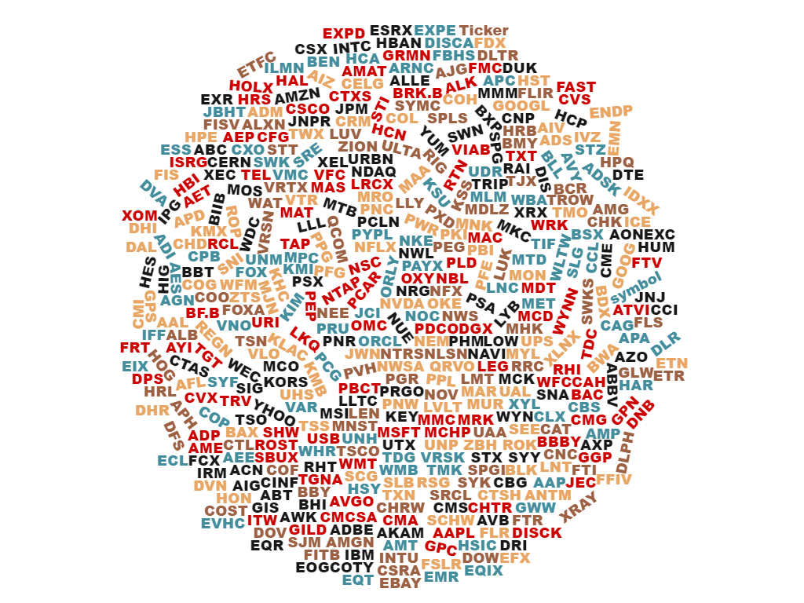
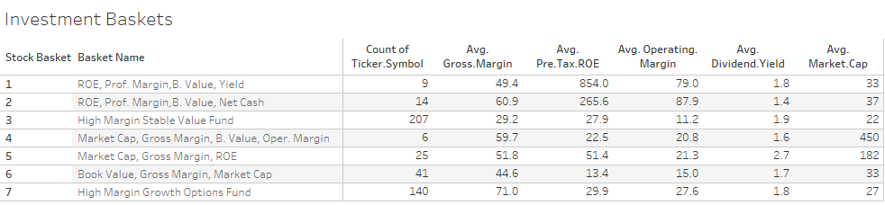
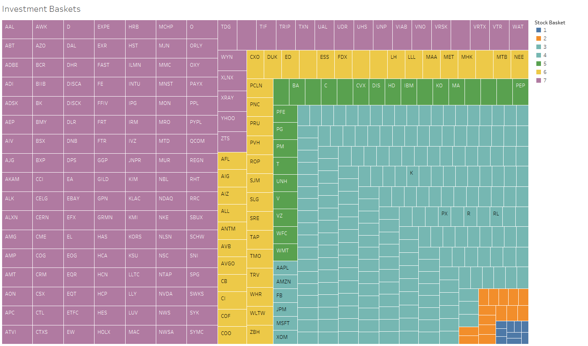
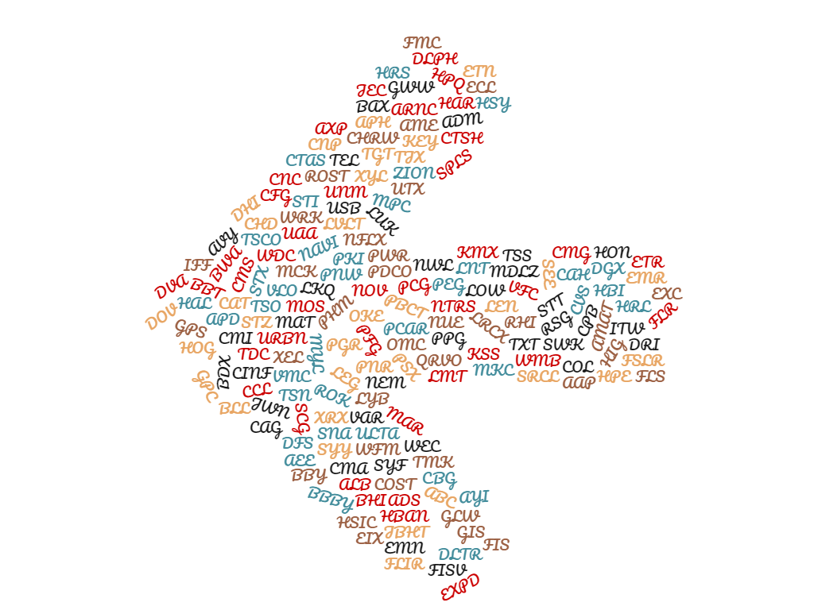

# R Packages

The packages you will need to install for the week are **readr**, **dplyr**, **ggplot2**, **VIM**, **lessR**, **fpc**,  and **cluster**.


# Analysis Goal 

IB Company: Identify alternative stock investment ideas from S&P500 index component companies to establish new investment baskets or index funds for better customer asset allocation and total return potential.

Standard and Poor’s 500 (S&P 500) is American stock market index based on market capitalizations of 500 (plus 5 due to share class) large companies. 

A drawback using S&P 500 index is it is disproportionately weighted towards large companies. The top 50 companies account for around 50% of the index value. 

Identify more focused equal weighted high profitable and return potential companies out of S&P 500 index. 


# The Dataset

* constituents.csv: general description of each company with division on sectors.

* fundamentals.csv: List of companies in the S&P 500 (Standard and Poor's 500). The S&P 500 is a free-float, capitalization-weighted index of the top 500 publicly listed stocks in the US (top 500 by market cap). The dataset includes a list of all the stocks contained therein and associated key financials such as gross margin, operating margin, ROE, earnings, cash ratio, fixed assets, total revenue etc. 

* Data sets are extracted from https://www.kaggle.com/dgawlik/nyse and http://data.okfn.org/data/core/s-and-p-500-companies websites. 




# Getting Started

```{r}
library(readr)
library(dplyr)

setwd("C:/Users/Jupiter/Downloads/RU/BIA6301ADM/Homework")

# finanaical ratios
rm(sp500_fin)
sp500_fin <- read_csv("C:/Users/Jupiter/Downloads/RU/BIA6301ADM/Homework/submission/week8/ADM_Week8_Project/ADM_Week8_Project/data/fundamentals_edit.csv")

# Company description and industry category
rm(sp500_dsc)
sp500_dsc <- read_csv("C:/Users/Jupiter/Downloads/RU/BIA6301ADM/Homework/submission/week8/ADM_Week8_Project/ADM_Week8_Project/data/constituents-financials_edit.csv")

str(sp500_fin)
str(sp500_dsc)

names(sp500_fin) <- make.names(names(sp500_fin))
names(sp500_dsc) <- make.names(names(sp500_dsc))


# Add company name and industory to financial data set
sp500.match.data <- inner_join(sp500_fin, sp500_dsc, by = c("Ticker.Symbol" = "Symbol"))

```


# Exploratory Data Analysis

```{r}

# Refine and rearrnge columns in the dataset
rm(sp500)
sp500 <- sp500.match.data[,c(1,26:32,3:25)]

#aggregate(sp500, list(sp500$Ticker.Symbol), mean)
summary(sp500)
```

## Identify Missing Data Values

```{r}
library (ggplot2)

pMiss <- function(x){sum(is.na(x))/length(x)*100}
apply(sp500,2,pMiss)
```

## Visualize data to identify any missing data

```{r}
library(VIM)
aggr_plot <- aggr(sp500, col=c('navyblue','red'), numbers=TRUE, sortVars=TRUE, labels=names(sp500), cex.axis=.7, gap=3, ylab=c("Histogram of missing data","Pattern"))
```

*No missing data is found in the dataset*


## Visualize numeric data distribution 

Draw a histogram of the Gross.Margin, Cost.of.Revenue and etc. then superimposes a normal curve on top for comparison purpose.


```{r}
library(lessR)
#Density(Gross.Margin, data=sp500)
#Density(Dividend.Yield, data=sp500)
Density(Book.Value, data=sp500)
#Density(Net.Cash.Flow, data=sp500)
```


The numeric data columns have outliers and distribution is sparse. We Will use normalization on certain numeric columns to minimize k-means sensitivity to outliers for the analysis.


# Normalize numeric columns in the data set

```{r}
sp500_ratio <-sp500[,c(4:14)]
sp500_num <-sp500[,c(15:31)]

normalize<- function(x){return((x-min(x))/(max(x)-min(x)))}
sp500_n<-as.data.frame(lapply(sp500_num, normalize))

```

## Summary the new variables

```{r}
summary(sp500_ratio)
summary(sp500_n)
```

## Combine all interested data columns into one data frame for analysis

Selected 18 qualitative data points from S&P500 index companies financial, profitability and income variables. The data set extracted from the online source only contained 445 companies out of 500 in the index, this is due to rest of the data is either missing or not available at the time of this analysis.

Selected variables are: Company ticker symbol, Name, Sector, Dividend Yield, ROe, Earnings, Market Cap, EBITDA, Book Value, Gross Margin, operating margin, Cash and  Cash equivelantes, Net cash flow, total revenu, liabilites, and etc. 


```{r}
sp500_nall <- cbind(sp500[,c(1:3)],sp500_ratio[,c(1:5,7,8,10)],sp500_n[,c(1,9,13:17)])

```

## Create interest data frame with selected variables 

```{r}
interests <- sp500_nall[,4:18] #select interested variables of company valuation and profit margin ratios

```


# Examine and run cluster analsyis?

This analysis will cluster S&P500 companies financial ratios like profitability margins, stock valuation ratios and other variables to identify smaller set of company groupings which provide significant alternative investment opportunities.


## Using Partitioning Approach for the analysis

General process:

1. Choose the number of clusters (k)
2. Partition the dataset into k clusters so that the sum of squared distances is minimized between the data points (p) and some center point [c(i)] in each cluster. 


## K-Means Clustering

Build a cluster model with three to nine clusters and then cross validate for final selection. 


*Outputs from kmeans:*
Size: Number of company stocks in each cluster.
Show the coordinates of the cluster centroids for the interested variables.


### What about k=3?
```{r}
library(fpc) #load this

set.seed(123)
sp500_clusters_3 <- kmeans(interests, centers=3) 
plotcluster(interests, sp500_clusters_3$cluster, main="k=3") 

sp500_clusters_3$size
t(sp500_clusters_3$centers) #transpose for ease of reading purpose
```

### Visualizing the Clusters

```{r}

plotcluster(interests, sp500_clusters_3$cluster, main="k = 3") #creates a visualization of the K=3 cluster. Are there distinct groups?

```


### What about k=4?

```{r}
set.seed(123)
sp500_clusters_4 <- kmeans(interests, centers=4) 
plotcluster(interests, sp500_clusters_4$cluster, main="k=4") 

sp500_clusters_4$size
t(sp500_clusters_4$centers) #transpose for ease of reading purpose
```


### What about k=5?

```{r}
set.seed(123)
sp500_clusters_5 <- kmeans(interests, centers=5) 
plotcluster(interests, sp500_clusters_5$cluster, main="k=5") 

sp500_clusters_5$size
t(sp500_clusters_5$centers) #transpose for ease of reading purpose
```

### What about k=6?

```{r}
set.seed(123)
sp500_clusters_6 <- kmeans(interests, centers=6) 
plotcluster(interests, sp500_clusters_6$cluster, main="k=6") 

sp500_clusters_6$size
t(sp500_clusters_6$centers) #transpose for ease of reading purpose
```


### What about k=7?

```{r}
set.seed(123)
sp500_clusters_7 <- kmeans(interests, centers=7) 
plotcluster(interests, sp500_clusters_7$cluster, main="k=7") 

sp500_clusters_7$size
t(sp500_clusters_7$centers) #transpose for ease of reading purpose
```


### What about k=8?

```{r}
set.seed(123)
sp500_clusters_8 <- kmeans(interests, centers=8) 
plotcluster(interests, sp500_clusters_8$cluster, main="k=8") 

sp500_clusters_8$size
t(sp500_clusters_8$centers) #transpose for ease of reading purpose
```

### What about k=9?

```{r}
set.seed(123)
sp500_clusters_9 <- kmeans(interests, centers=9) 
plotcluster(interests, sp500_clusters_9$cluster, main="k=9") 

sp500_clusters_9$size
t(sp500_clusters_9$centers) #transpose for ease of reading purpose
```


  #### Examine the betweenss and withinss ratios!

We want the clusters to demonstrate both cohesion and separation. Cohesion is measured by minimizing the ratio of withinss/totalss. Separation is measured by maximizing the ratio of betweenss/totalss.

##### Cluster Separation

```{r}
clusters3<- sp500_clusters_3$betweenss/sp500_clusters_3$totss
clusters4<- sp500_clusters_4$betweenss/sp500_clusters_4$totss
clusters5<- sp500_clusters_5$betweenss/sp500_clusters_5$totss
clusters6<- sp500_clusters_6$betweenss/sp500_clusters_6$totss
clusters7<- sp500_clusters_7$betweenss/sp500_clusters_7$totss
clusters8<- sp500_clusters_8$betweenss/sp500_clusters_8$totss
clusters9<- sp500_clusters_9$betweenss/sp500_clusters_9$totss

betweenss.metric <- c(clusters3, clusters4, clusters5, clusters6, clusters7, clusters8, clusters9)
print(betweenss.metric) #Look for a ratio that is closer to 1.
```

k=7 has the most in separation and after that seperation remained flat.


*Cluster Separation* : 
 *| 0.7226899 | 0.7934258 | 0.8127400 | 0.8224078 | 0.8532324 | 0.8664625 | 0.8697944 |*


##### Cluster Cohesion

```{r}
clusters3<- sp500_clusters_3$tot.withinss/sp500_clusters_3$totss
clusters4<- sp500_clusters_4$tot.withinss/sp500_clusters_4$totss
clusters5<- sp500_clusters_5$tot.withinss/sp500_clusters_5$totss
clusters6<- sp500_clusters_6$tot.withinss/sp500_clusters_6$totss
clusters7<- sp500_clusters_7$tot.withinss/sp500_clusters_7$totss
clusters8<- sp500_clusters_8$tot.withinss/sp500_clusters_8$totss
clusters9<- sp500_clusters_9$tot.withinss/sp500_clusters_9$totss

totwithinss.metric <- c(clusters3, clusters4, clusters5, clusters6, clusters7, clusters8, clusters9)
print(totwithinss.metric) #Looking for a ratio that is closer to 0. 

```

k=7 also has the most cluster cohesion reduction and then remained flat.


*Cluster Cohesion*
*| 0.2773101 | 0.2065742 | 0.1872600 | 0.1775922 | 0.1467676 | 0.1335375 | 0.1302056 |*


#### Using the "Elbow Method" for cross validation 

**The elbow method looks at the percentage of variance explained as a function of the number of clusters: One should choose a number of clusters so that adding another cluster doesn't give much better modeling of the data.**


##### Withinss

```{r}
#WithinSS
wss <- (nrow(interests)-1)*sum(apply(interests,2,var))
for (i in 2:10) wss[i] <- sum(kmeans(interests,
                                     centers=i)$withinss)
plot(1:10, wss, type="b", xlab="Number of Clusters",
     ylab="Within Sum of Squares", main = "Number of Clusters (k) versus Cluster Cohesiveness")

```


##### BetweenSS

```{r}
#BetweenSS
wss <- (nrow(interests)-1)*sum(apply(interests,2,var))
for (i in 2:10) wss[i] <- sum(kmeans(interests,
                                     centers=i)$betweenss)
plot(1:10, wss, type="b", xlab="Number of Clusters",
     ylab="Between Group Sum of Squares", main = "Number of Clusters (k) versus Cluster Distinctiveness")

```


*The elsbow analysis also identifies k=7 (seven clusters) to be significant*


# Creating an Aggregate Profile for Our Clusters

Compare cluster 5, 6 and 7 to validate which one is good fit for final analysis.
We can sort the centroids for each cluster to see what financial ratios are significan in each groups


## cluster 5 details review 

```{r}
sp500_clusters_5$size #Get the size of each cluster
Clusters_5<-data.frame(t(sp500_clusters_5$centers)) #Transpose for easier reading

Clusters_5[order(-Clusters_5$X1), ] 
Clusters_5[order(-Clusters_5$X2), ]
Clusters_5[order(-Clusters_5$X3), ]
Clusters_5[order(-Clusters_5$X4), ]
Clusters_5[order(-Clusters_5$X5), ]

```

## cluster 6 details review 

```{r}
sp500_clusters_6$size #Get the size of each cluster
Clusters_6<-data.frame(t(sp500_clusters_6$centers)) #Transpose for easier reading

Clusters_6[order(-Clusters_6$X1), ] 
Clusters_6[order(-Clusters_6$X2), ]
Clusters_6[order(-Clusters_6$X3), ]
Clusters_6[order(-Clusters_6$X4), ]
Clusters_6[order(-Clusters_6$X5), ]
Clusters_6[order(-Clusters_6$X6), ]

```


## cluster 7 details review 

```{r}
sp500_clusters_7$size #Get the size of each cluster
Clusters_7<-data.frame(t(sp500_clusters_7$centers)) #Transpose for easier reading

Clusters_7[order(-Clusters_7$X1), ] 
Clusters_7[order(-Clusters_7$X2), ]
Clusters_7[order(-Clusters_7$X3), ]
Clusters_7[order(-Clusters_7$X4), ]
Clusters_7[order(-Clusters_7$X5), ]
Clusters_7[order(-Clusters_7$X6), ]
Clusters_7[order(-Clusters_7$X7), ]

```


*cluster 7 is selected as final result from this analysis*


# Add cluster number to the S&P500 data set for result ploting and review 

```{r}
# apply the cluster IDs to the original data frame to group companies together 
sp500$cluster7 <- sp500_clusters_7$cluster #adds the cluster number to each record

```


# Analysis final cluster result descriptions 

To create "meaning" for our clusters, gave each cluster an "identity." 

**Cluster/Stock Basket 1** (9 Companies): Pre.Tax ROE, Operating.Margin, Gross.Margin, Market.Cap, and Book.Value. Other ratios with smaller centeroids: EBITDA, Devidend.Yield, Sale.and.Purchase.Of.Stock, Earning.Share, Total.Equity.

These companies are mainly High Return on Equity, Profit Margin, Book Value, with Devidend Yield. 


**Cluster/Stock Basket 2** (14 Companies): Pre.Tax ROE, Operating.Margin, Gross.Margin, Market.Cap, and Book.Value. Other ratios with smaller centeroids: EBITDA, Devidend.Yield, Sale.and.Purchase.Of.Stock, Earning.Share, Net.Cash.Flow.Operating.

These companies are mainly High Return on Equity, Profit Margin, Book Value, Devidend Yield, with Net Cash Flow. 


**Cluster/Stock Basket 3** (207 Companies): Gross.Margin, Pre.Tax ROE, Book.Value, Market.Cap, and Operating.Margin. Other ratios with smaller centeroids: Earning.Share, EBITDA, Devidend.Yield, and Sale.and.Purchase.Of.Stock.

These companies are mainly High Gross Margin, Return on Equity, Book Value, with Market Cap. 

*This stock basket is called "High Margin Stable Value Fund"*

**Cluster/Stock Basket 4** (6 Companies): Market.Cap, Gross.Margin, Book.Value, EBITDA, Pre.Tax ROE, and Operating.Margin. Other ratios with smaller centeroids: Earning.Share, Devidend.Yield, and Sale.and.Purchase.Of.Stock.

These companies are mainly High Market Cap, Gross Margin, Book Value, with Operating Margin.
. 

**Cluster/Stock Basket 5** (25 Companies): Market.Cap, Gross.Margin, Pre.Tax ROE, Operating.Margin, Book.Value, and EBITDA. Other ratios with smaller centeroids: Earning.Share, and Devidend.Yield.

These companies are mainly High Market Cap, Gross Margin, with high Return on Equity. 


**Cluster/Stock Basket 6** (41 Companies): Book.Value, Gross.Margin, Market.Cap, Operating.Margin, Pre.Tax ROE, and Earning.Share. Other ratios with smaller centeroids:  EBITDA, Devidend.Yield, and Sale.and.Purchase.Of.Stock.

These companies are mainly High Book Value, Gross Margin, Market Cap, with Operating Margin


**Cluster/Stock Basket 7** (140 Companies): Gross.Margin, Pre.Tax ROE, Operating.Margin,  Market.Cap, Book.Value, and Earning.Share. Other ratios with smaller centeroids: EBITDA, Devidend.Yield, and Sale.and.Purchase.Of.Stock.

These companies are mainly High Gross Margin, Return on Equity, Operating Margin, and Earning Potential. 

*This stock basket is called "High Margin Growth Options Fund"*


# Write the final output into csv file for further analysis and presenation 

*writes the S&P500 variables data frame and cluster each company assigned into csv file*

```{r}

write.csv(sp500, file = "C:/Users/Jupiter/Downloads/RU/BIA6301ADM/Homework/submission/week8/ADM_Week8_Project/ADM_Week8_Project/data/sp500_new.csv")


```


# Recommendation 

Based on the above analysis, I recommend following alternative investment index ideas and stock baskets. These investment options provide customers with new choice to improve asset allocation and return potential in the investment portfolios. 


**"High Margin Stable Value Fund" - containing 207 high quality company stocks**

**"High Margin Growth Options Fund" - - containing 140 high quality company stocks**


# Results Table and Heat Map

Final results are ran through external visualization tool called Tableau to review results and present it to the end deecision makers for easier understanding.  

*Table*




[Visualize Result Table](https://public.tableau.com/profile/raju.penmetcha#!/vizhome/RUWeek8a/Sheet2)

*Heat Map*





[Visualize Result Heatmap](https://public.tableau.com/profile/raju.penmetcha#!/vizhome/RUWeek8a/Sheet1)





### Using Pseudo t^2 to Get an Automatic Pick


```{r}
library(NbClust)
NbClust(data=interests, min.nc=2, max.nc=9, method="complete", index="pseudot2")
```


**Based on above automatic pick analysis it appears cluster run of 3 to be good fit, howerver the original goal to exclude high market cap companies from the selected basket or grouping did not achived therefor this cluster 3 pick may need even further analysis and also may need more data points to get better overall results.**
